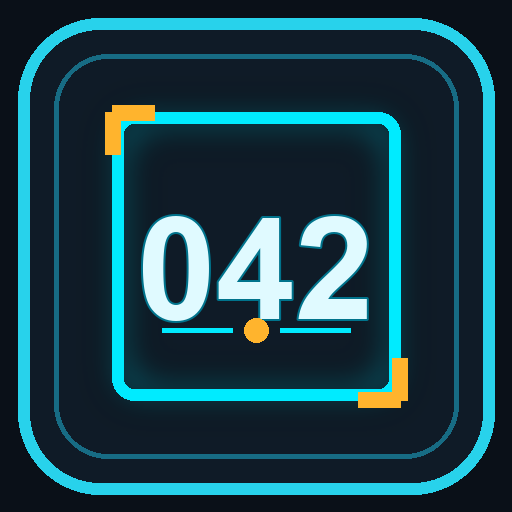

# CoD Warzone Lobby Code Reader

Application Windows qui permet de sélectionner une zone de l’écran, puis de lire automatiquement le code numérique du lobby Call of Duty: Warzone grâce à l’OCR.



## Fonctionnalités

- Sélection de la zone OCR sur n’importe quel moniteur, y compris dans une configuration multi-écrans.
- Aperçu en direct de la zone sélectionnée.
- Lecture OCR limitée aux chiffres pour une détection plus fiable du code de lobby.
- Affichage du dernier code détecté en lecture seule.
- Historique des codes détectés.
- Copie du code courant ou d’un élément de l’historique dans le presse-papiers.
- Icône Windows incluse pour l’application et l’exécutable.

## Prérequis

- Windows 10 ou Windows 11
- Python 3.10 ou version plus récente
- Une connexion Internet au premier lancement : EasyOCR peut télécharger ses modèles de reconnaissance

> L’application est actuellement conçue pour Windows. La sélection multi-écrans utilise les coordonnées du bureau virtuel Windows.

## Installation

1. Clonez le dépôt, puis ouvrez PowerShell dans le dossier du projet.

   ```powershell
   git clone https://github.com/VOTRE-UTILISATEUR/warzone-lobby-code-reader.git
   cd warzone-lobby-code-reader
   ```

2. Créez et activez un environnement virtuel.

   ```powershell
   py -3.10 -m venv .venv
   .\.venv\Scripts\Activate.ps1
   ```

3. Installez les dépendances.

   ```powershell
   python -m pip install --upgrade pip
   python -m pip install mss opencv-python easyocr numpy pillow pyperclip
   ```

## Lancer l’application

Depuis l’environnement virtuel activé :

```powershell
python .\lobby_reader.py
```

Au premier démarrage, le chargement d’EasyOCR peut prendre un peu plus de temps.

## Utilisation

1. Cliquez sur **Sélectionner la zone OCR**.
2. Cliquez-glissez autour du code affiché dans le lobby Warzone ; la sélection peut être faite sur n’importe quel écran.
3. Relâchez le bouton de la souris pour enregistrer la zone.
4. Vérifiez l’aperçu et le nombre lu dans la fenêtre.
5. Cliquez sur **Copier**, ou sélectionnez un élément de l’historique, pour le placer dans le presse-papiers.

Pendant la sélection, appuyez sur `Échap` ou faites un clic droit pour annuler.

## Réglages utiles

Les réglages principaux se trouvent en haut de `lobby_reader.py` :

| Variable | Rôle | Valeur par défaut |
| --- | --- | --- |
| `DELAY` | Fréquence de lecture OCR, en secondes | `0.3` |
| `PREVIEW_DELAY` | Fréquence de mise à jour de l’aperçu, en secondes | `1.0` |
| `PREVIEW_SIZE` | Taille de l’aperçu dans la fenêtre | `(360, 140)` |

Pour une meilleure reconnaissance, sélectionnez uniquement les chiffres du code en évitant les éléments visuels proches.

## Créer un exécutable Windows

Installez PyInstaller :

```powershell
python -m pip install pyinstaller
```

Puis créez l’exécutable avec l’icône :

```powershell
py -3.10 -m PyInstaller --noconfirm --clean --onefile --windowed --icon .\lobby_reader_icon.ico --add-data ".\lobby_reader_icon.ico;." .\lobby_reader.py
```

Le fichier final sera disponible dans `dist\lobby_reader.exe`.

## Dépendances utilisées

| Bibliothèque | Utilisation |
| --- | --- |
| [EasyOCR](https://github.com/JaidedAI/EasyOCR) | Reconnaissance des chiffres à l’écran |
| [MSS](https://github.com/BoboTiG/python-mss) | Capture rapide de la zone d’écran |
| [OpenCV](https://opencv.org/) | Prétraitement de l’image OCR |
| [Pillow](https://python-pillow.org/) | Conversion et affichage de l’aperçu |
| [Pyperclip](https://github.com/asweigart/pyperclip) | Copie dans le presse-papiers |
| [Tkinter](https://docs.python.org/3/library/tkinter.html) | Interface graphique, inclus avec Python standard |

## Structure du projet

```text
.
├── lobby_reader.py           # Application principale
├── lobby_reader_icon.ico     # Icône Windows
├── lobby_reader_icon.png     # Aperçu de l’icône
└── README.md
```

## Licence

[MIT](https://choosealicense.com/licenses/mit/)

## Avertissement

Ce projet lit uniquement une zone affichée à l’écran et ne modifie pas le jeu, n’interagit pas avec ses fichiers et n’automatise aucune action en jeu. Respectez les règles, conditions d’utilisation et politiques applicables à Call of Duty: Warzone.